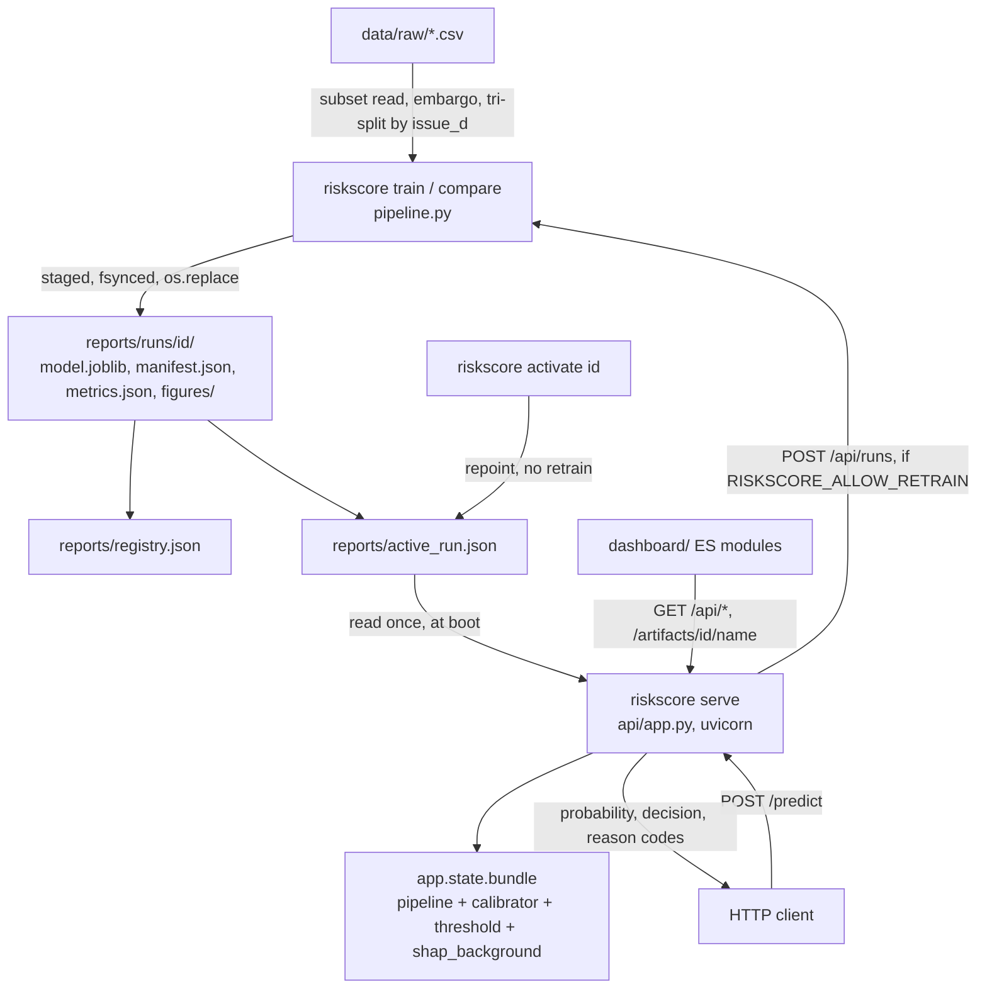

# Credit default risk score

An interpretable, leakage-aware machine learning pipeline that predicts the probability a loan will default, using the Lending Club dataset, plus a scoring service that serves it.


*The local dashboard showing model metrics, calibration plot, and threshold cost analysis.*

## What it does

A credit model that scores well on a random split is usually cheating, and the ways it cheats are known: post-origination columns that encode the answer, a closed-loans filter that quietly keeps only loans old enough to have failed, the lender's own interest rate standing in for the lender's own risk assessment, and a threshold picked after looking at the test set.
This project is organized around not doing those four things, and around being able to show that it didn't.

Given a borrower's information at the time they apply, it estimates the probability the loan defaults and returns the reasons behind the number.
Training moves from the raw extract through feature engineering, calibration, and business-aware threshold selection, comparing a logistic regression baseline against XGBoost on one identical split.
Each run publishes an immutable, self-describing directory: the model, the calibrator, the threshold it chose, every metric and figure, and a generated model card.

Serving loads one of those directories and answers `POST /predict` in single-digit milliseconds with a calibrated probability, an approve/decline decision at the run's own threshold, and exact SHAP reason codes that sum back to the model's log-odds.

So: post-origination columns are excluded by name, the lender's pricing is held out by default and its contribution measured rather than asserted, an outcome-maturity embargo removes the survivorship bias in the naive closed-loans filter, and the calibrator and threshold are fitted on validation so the test set is scored exactly once.

## Tech stack

Python 3.12+, with extras split by what a deployment actually needs.

| Layer | What it uses |
| --- | --- |
| Core | pandas, numpy, scipy, scikit-learn, joblib, pyyaml |
| Training extra | XGBoost, matplotlib, pyarrow |
| Serving extra | FastAPI, uvicorn, pydantic, pydantic-settings |
| Dashboard | Vanilla ES modules. No npm install, no bundler |
| Checks | pytest, pytest-cov, hypothesis, ruff, mypy strict |

Notably absent: `shap`. Reason codes are exact SHAP values computed from the model's own coefficients for the linear model and from XGBoost's built-in TreeSHAP for the boosted one, which is a dozen lines in `explain.py` against a numba and llvmlite toolchain.

## Architecture

Two processes that share no state except a directory.



Follow one score through it.
`riskscore train` reads the extract, applies the embargo before the split so all three partitions share one definition of "outcome known", fits the estimator on train, fits the calibrator and picks the threshold on validation, scores test exactly once, and writes the whole thing into a staging directory that gets `os.replace`d into place, so a run directory is either absent or complete.
`riskscore serve` reads `active_run.json` at boot, unpickles the bundle once, and builds the SHAP explainer from the 200-row background summary that shipped inside it, which is why the hot path does zero disk IO and `POST /predict` lands around 7.6 ms p50, or 14.9 ms with reason codes.
Training never imports the API, and the one place the API reaches back into `pipeline.py` runs it in a child process behind an off-by-default flag, so the retraining blast radius is a single edge on that graph.

Fuller version, including the module dependency layering and the route-by-security-line split, is in [docs/architecture.md](docs/architecture.md).

## What building this taught me

My KS statistic took `.abs()` of the gap between the two cumulative curves, so a model with inverted labels scored 0.93 KS next to 0.07 AUC.
The one metric that should have flagged the bug agreed with it instead.
It's now the one-sided maximum of `F_default - F_non_default`, and a test checks it against scipy's `ks_2samp`.

`SimpleImputer(add_indicator=True)` put the missing-value indicators inside the numeric branch, so `StandardScaler` scaled them.
A rare gap gave its indicator a tiny standard deviation, and one omitted field on a `/predict` request pushed that feature 60 standard deviations out and dropped the probability from 0.070 to 0.004.
The indicators now get their own unscaled branch.

I drew calibration curves for weeks without ever applying the correction.
`calibrate_model` was never called, and it would have failed anyway, since it used `cv="prefit"`, which scikit-learn 1.9 removed.
The calibrator is now fitted on the validation split and ships inside the run bundle.

## Documentation

[docs/README.md](docs/README.md) is the index.

- [architecture.md](docs/architecture.md) covers what runs in what order, the module dependency layers, and why the route surface splits along a security line.
- [code/](docs/code/) has one page per source file, and `scripts/check_docs.py` fails CI if a file exists without one.
- [data-dictionary.md](docs/data-dictionary.md) is every column, its dialect in the raw extract, and which feature tier admits it.
- [runbook.md](docs/runbook.md) is operating the service: the routes, the retrain panel, rollback.
- [decisions/](docs/decisions/) holds the eight ADRs, including the ones on [feature engineering inside the pipeline](docs/decisions/0002-feature-engineering-inside-the-pipeline.md), the [outcome-maturity embargo](docs/decisions/0004-outcome-maturity-embargo.md), and [retraining in a child process](docs/decisions/0008-retraining-in-a-child-process.md).
- [examples/model_card.example.md](docs/examples/model_card.example.md) is what `riskscore card` generates.

## Quick start

```bash
python -m venv .venv
source .venv/bin/activate
pip install -e ".[dev]"
```

No 1.19 GB download needed to try it.
`make-sample-data` writes a synthetic extract shaped like the real one, including the survivorship bias the pipeline has to correct for:

```bash
riskscore make-sample-data data/sample/loans.csv
riskscore train data/sample/loans.csv
riskscore runs
```

Then serve the run you just published. The API and the dashboard come from the same process, bound to localhost:

```bash
riskscore serve            # http://127.0.0.1:8000
```

```bash
curl -s localhost:8000/predict -H 'content-type: application/json' -d '{
  "loan_amnt": 12000, "term": " 36 months", "annual_inc": 62000,
  "purpose": "debt_consolidation", "home_ownership": "RENT",
  "dti": 18.4, "revol_util": "62.5%", "issue_d": "Jun-2015",
  "earliest_cr_line": "Aug-2003", "open_acc": 9, "total_acc": 22
}'
```

The request takes the raw extract's dialect or the parsed forms interchangeably, because the parsing is a step inside the pickled pipeline rather than a copy of the training code.
`GET /api/schema` is the authoritative field list for whichever bundle is loaded.

For the real thing, put the Lending Club extract under `data/raw/` and point `train` at it.
Pass `--model xgboost` to fit XGBoost, and `--include-lender-priced` to admit the interest rate and grade, which are the lender's own price and so are excluded by default.
`riskscore compare` fits several variants on one split and publishes the comparison.
`riskscore activate <run_id>` rolls back to an earlier run without retraining, and `riskscore --help` documents the rest.
