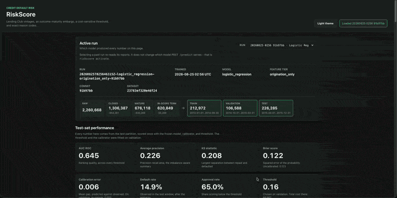

# Credit Default Risk Modeling

An interpretable, leakage-aware machine learning pipeline that predicts the probability a loan will default, using the Lending Club dataset.

 \\
*The local dashboard showing model metrics, calibration plot, and threshold cost analysis.*

## What It Does

Given a borrower's information at the time they apply for a loan, this project estimates the probability that the loan will default.
It moves from raw loan data through feature engineering, model training, calibration, and business-aware threshold selection, comparing a logistic regression baseline against XGBoost.
The focus is on a defensible risk model, not just a high-scoring one: no data leakage, time-based validation, and clear tradeoffs between false positives and false negatives.

## Tech Stack

- Python
- pandas / numpy
- scikit-learn
- XGBoost
- SHAP
- matplotlib / seaborn
- pytest

## Install and Run

```bash
python -m venv .venv
source .venv/bin/activate
pip install -e ".[dev]"
```

Place Lending Club data under `data/raw/`, then run the baseline:

```bash
python scripts/run_baseline.py \
  --raw-data-path data/raw/lending_club_loans.csv \
  --train-end-date 2016-12-31 \
  --test-start-date 2017-01-01
```

Pass `--model-type xgboost` to run XGBoost instead. Then start the dashboard:

```bash
python scripts/serve_dashboard.py
```

Open `http://127.0.0.1:8765`.
